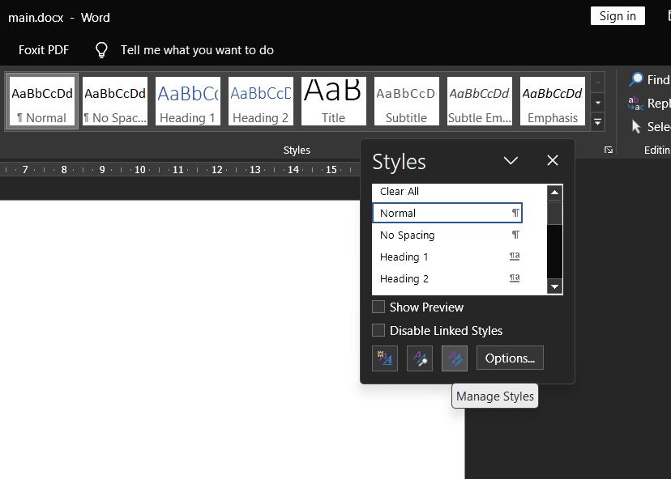
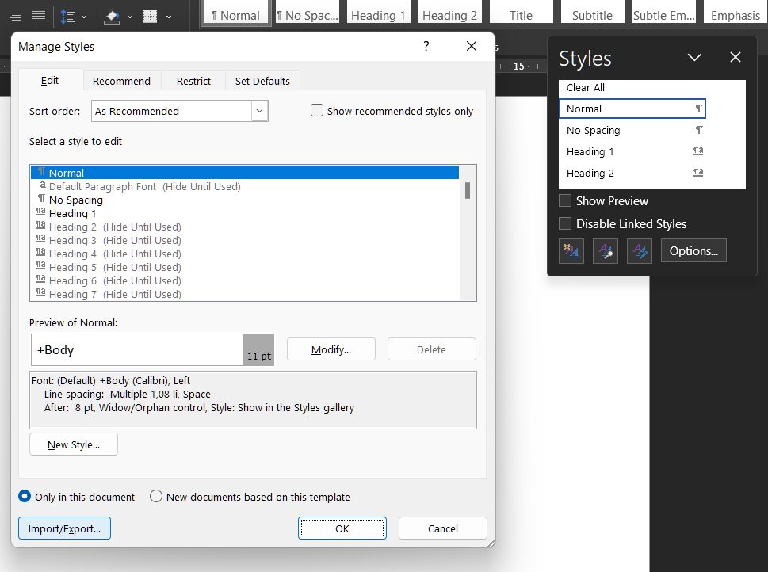
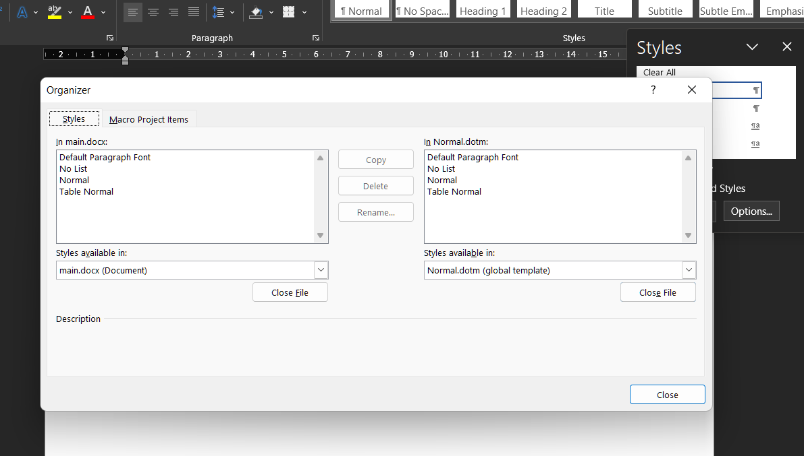
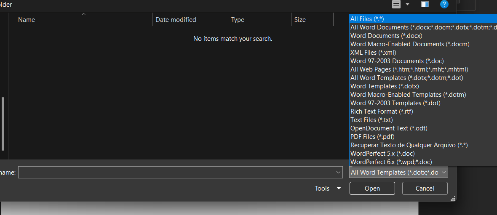
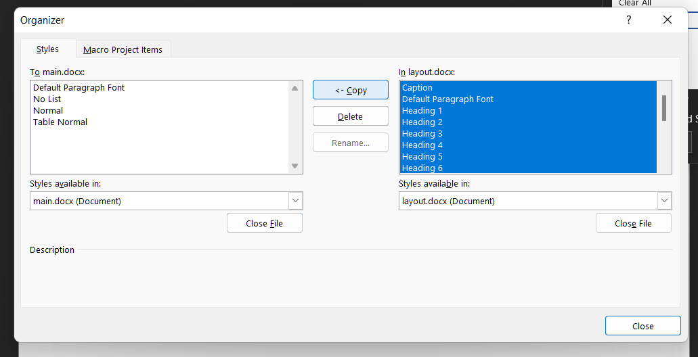
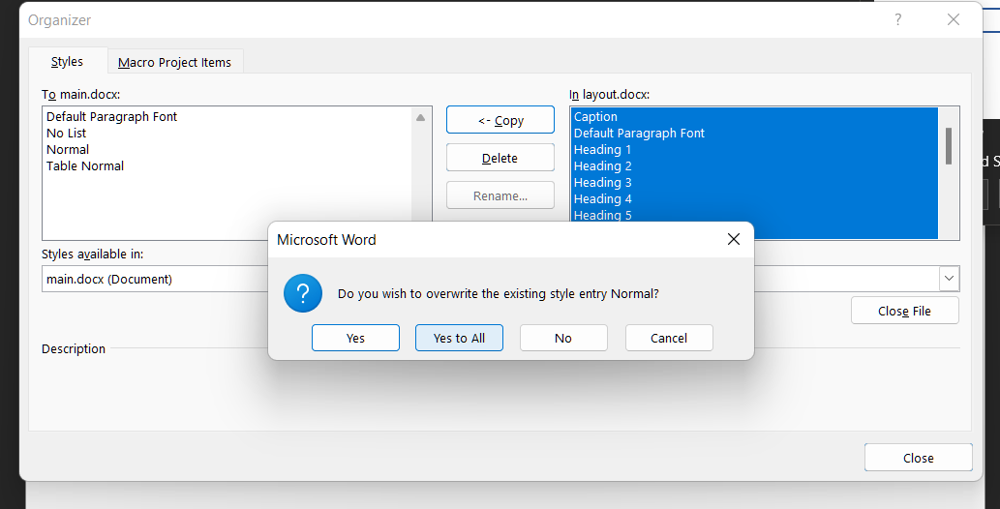
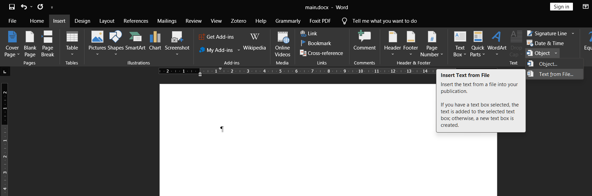
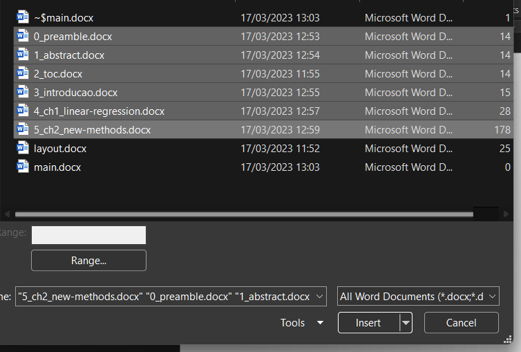

# msword-template
Esse repositório contém um template de Word que pode ser utilizado para escrever relatórios, teses e dissertações. Cada elemento do documento é escrito separadamente e compilado em um único arquivo. A formatação é aplicada somente no arquivo final.

# Como utilizar o template
A pasta *files* contém diversos arquivos de Word. Todos os items cujos nomes iniciam com números fazem parte do corpo do documento final. O número indica a posição de cada arquivo no documento completo. Esse detalhe é **muito importante**, o nome dos arquivos **deve** refletir a ordem de inserção no documento final. Por convenção, o arquivo final é denominado **main.docx**. Veja abaixo instruções de como gerá-lo a partir do zero. 

Todos os arquivos numerados **não possuem nenhuma formatação do Word**. O principal recurso que deve ser utilizado são os títulos. Para cada capítulo utilize o estilo *Título 1* e *Título 2* e outros para sub-capítulos. **Não utilize nenhuma formatação nesses arquivos**. Não se preocupe com numeração dos capítulos, será aplicada automaticamente no momento de compilar os arquivos. Esses arquivos devem ser o mais simples quanto possível, pois a formatação é aplicada no momento de criar o documento completo.

O arquivo **layout.docx** controla a formatação do arquivo final. Eu já apliquei formatos para todos os títulos, para o corpo do texto e sumários nesse arquivo. Modifique conforme sua necessidade. Modificações possíveis incluem tamanho de fonte, fonte, margens, entre outras. Não adianta modificar os textos manualmente. Qualquer modificação em elementos textuais **deve ser realizada via modificação dos estilos**.

# Como compilar o arquivo final

1. Crie um arquivo do Word em branco com o nome **main.docx**
2. Em seguida, vamos aplicar os estilos contidos no arquivo **layout.docx**. Na aba *Home*, procure a lista de estilos e clique no símbolo de seta no canto inferior do menu de estilos. Uma janela tal como mostrado abaixo deverá aparecer. Clique na opção *Manage Styles*. É a terceira caixa.

3. No menu *Manage Styles* clique em *Import/Export...*

4. Agora clique em *Close file*. Em seguida, clique em *Open file*.

5. Escolha a opção *All files (\*.\*)*. Agora, encontre o arquivo **layout.docx** e selecione-o.

6. Selecione **todos** os estilos do arquivo **layout.docx**. Então clique em *<- Copy*.

7. Confirme que deseja substituir os estilos do arquivo **main.docx**. Clique em *Yes to All*

8. Agora vamos inserir os arquivos individuais. Vá até a aba *Insert* e clique na seta ao lado de *Object*. Escolha a opção *Text from File...*.

9. Selecione os arquivos que deseja inserir. Então clique em *Insert*

10. Pronto. Todos os items serão inseridos já com a formatação. 
11. Atualize os índices de interesse (Lista de Figuras, Tabelas, Sumário e outros). Em alguns casos, é necessário remover manualmente o *indent* na primeira linha (por exemplo o nome na capa e os títulos das páginas contendo a lista de figuras e tabelas).